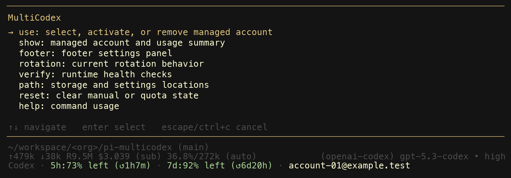
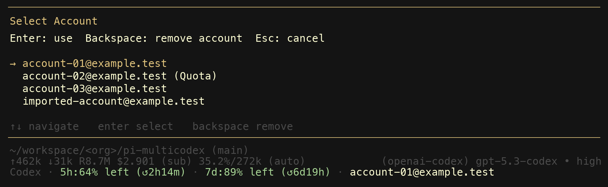
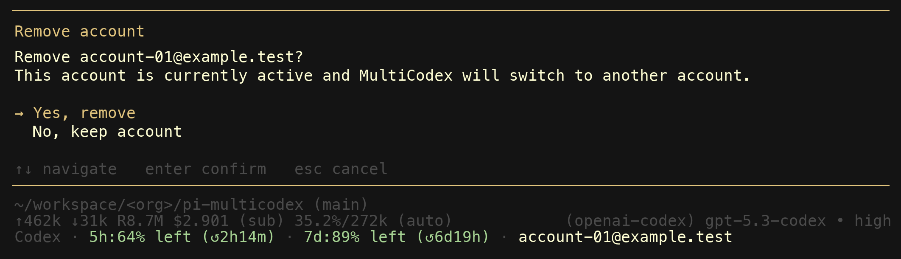
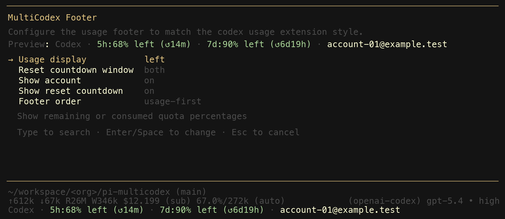

# lexlexlex-multicodex



MultiCodex is a [pi](https://github.com/badlogic/pi-mono) extension that manages multiple ChatGPT Codex accounts and rotates between them automatically when you hit quota limits.

You add your Codex accounts once. After that, MultiCodex transparently picks the best available account for every request. When one account runs dry mid-session, it switches to another and retries — no manual intervention needed.

## Getting started

Install this local extension:

```bash
pi install ./lexlexlex-multicodex
```

Restart pi. That is all you need — MultiCodex takes over the normal `openai-codex` provider path and auto-imports any Codex auth you have already set up in pi.

To manage your accounts inside a session, type `/multicodex`.

## How it works

When you start a session, MultiCodex:

1. Imports your existing pi Codex auth automatically (if present).
2. Merges duplicate imported credentials into the managed pool so one account does not consume multiple rotation slots.
3. Checks usage data across all managed accounts.
4. Selects accounts in this order: selected account, unused account, lowest usage, then random when usage is unknown.

A selected account stays in use until it becomes unavailable or you clear the selection. If its login stops working or its limit is reached, MultiCodex clears the selection and uses another account.

Before output starts, a limit error pauses the account until reset and uses another account. A request can try up to 6 accounts total: the first account plus 5 retries. If an account's login stops working, MultiCodex skips it without sending a request. Your normal pi login can also be used temporarily, but it is not added to the saved account list. Once output has started, the error is returned without switching accounts.

## Commands

Account and footer controls live under `/multicodex`; Fast routing uses `/fast`.

| Command | What it does |
|---|---|
| `/multicodex` | Open the main interactive menu |
| `/multicodex accounts [identifier]` | Inspect account health, select an account, add one, or directly activate/login by identifier |
| `/multicodex use [identifier]` | Alias for `/multicodex accounts [identifier]` |
| `/multicodex alias <identifier> [name]` | Rename an account alias; use `--clear` to remove it |
| `/multicodex show` | Alias for the account-management view; in non-interactive mode it prints per-account health lines |
| `/multicodex refresh [identifier\|all]` | Refresh token validity and usage data for one account or all accounts |
| `/multicodex reauth [identifier]` | Re-authenticate one account explicitly |
| `/multicodex footer` | Configure the usage footer display |
| `/fast` | Toggle session-only Codex Fast routing |
| `/multicodex rotation` | Show the current rotation policy |
| `/multicodex verify` | Check storage, settings, auth import, and reauth health |
| `/multicodex path` | Print storage and settings file locations |
| `/multicodex reset [manual\|quota\|all]` | Clear manual override, quota cooldowns, or both |
| `/multicodex help` | Print a compact usage line |

All subcommands support dynamic autocomplete. Account-focused subcommands autocomplete from the managed account list.

Commands that do not need a UI panel (`show`, `refresh`, `verify`, `path`, `reset`, `help`) work in non-interactive mode too.

## Account manager

The `/multicodex accounts` panel merges the old `show` and `use` flows into one place.



- **enter** activates the highlighted account.
- **u** refreshes token and usage health for the selected account.
- **r** re-authenticates the selected account.
- **n** starts login for a new managed account.
- **a** renames the selected account alias.
- **backspace** removes the selected account after confirmation.

Each row shows the account identifier, active/manual state, reauth state, quota state, linked imported auth state, and cached 5-hour and weekly usage windows.

When you remove an active account, MultiCodex switches to the next available one automatically.



## Usage footer

MultiCodex adds a live footer to your session showing the active account, 5-hour and 7-day usage percentages, and reset countdowns. The footer updates after every turn and on account switches.

You can customize which fields appear and their ordering with `/multicodex footer`. The `raw` usage display shows the account alias followed by remaining quota as `alias · 5h:X%, W:Y%`, and the footer polls every five seconds. When Fast mode is enabled, a red `fast` marker appears after the usage elements.

Use `/fast` to send supported official Codex requests with `service_tier: priority`. Fast mode is session-only, resets when you switch sessions, and is hidden when disabled. It applies to `gpt-5.4`, `gpt-5.5`, `gpt-5.6-luna`, `gpt-5.6-sol`, and `gpt-5.6-terra` on the official ChatGPT Codex endpoint.



## What it does under the hood

- **Provider override.** MultiCodex registers itself as the `openai-codex` provider. You do not need to select a different provider or change your model — it works with whatever Codex model you already use.
- **Fast routing.** `/fast` changes only the current session state. A request hook adds the priority service tier for supported official models, and a message hook corrects Fast usage costs without changing provider or model IDs.
- **Auth import.** When pi has stored Codex OAuth credentials, MultiCodex imports them automatically and merges duplicate credentials into existing managed accounts when possible.
- **Token refresh.** OAuth tokens are refreshed before expiry so requests do not fail due to stale credentials. You can also force a health refresh with `/multicodex refresh` or re-authenticate explicitly with `/multicodex reauth`.
- **Usage tracking.** Usage data is fetched from the Codex API. The footer polls the active account every five seconds and caches account data for other rotation checks.
- **Quota cooldown.** When an account is exhausted, it stays on cooldown until the last exhausted usage window resets (or 1 hour when the reset time is unknown). Before each request, and at session start, MultiCodex compares every cooldown with the Codex usage API and clears any marker the API contradicts, so a transient limit error cannot park a working account. `/multicodex refresh` runs the same check on demand, and `/multicodex reset quota` clears markers by hand.
- **Shared utility seams.** Provider mirroring, stream primitives, and `~/.pi/agent/*` path helpers are shared with `pi-credential-vault` through `pi-provider-utils`. MultiCodex still owns account storage, token policy, footer behavior, and command UX.

## Local development

This monorepo uses `bun` workspaces for dependency management.

```bash
cd /path/to/pi-packages
bun install
bun run --filter @carter-mcalister/pi-multicodex check
npm pack --dry-run    # verify package contents
```

Run the extension directly during development:

```bash
pi -e ./index.ts
```

## Data storage

MultiCodex stores all data locally under `~/.pi/agent/`:

| File | Contents |
|---|---|
| `codex-accounts.json` | Managed account credentials and state |
| `settings.json` (key `pi-multicodex`) | Footer display preferences |

No data is sent anywhere except to the Codex API endpoints for auth refresh and usage queries.

## Release process

Releases are automated. Push a conventional commit to `main` and GitHub Actions handles versioning, changelog, npm publishing (via trusted publishing), and GitHub releases.

Local push protection via `lefthook` runs the same checks as CI before every push.

## Roadmap

See [ROADMAP.md](ROADMAP.md) for planned work including configurable rotation settings, a shared controller architecture, and immediate footer persistence.

## Prior art and how this project differs

This extension builds on ideas from two earlier pi extensions. Both deserve credit for establishing the patterns that made this project possible.

### [kim0/pi-multicodex](https://github.com/kim0/pi-multicodex)

The original MultiCodex extension by [kim0](https://github.com/kim0). It introduced the core concept: manage multiple Codex OAuth accounts and rotate between them on quota failures. The original shipped as a single `index.ts` file (~990 lines) with three top-level commands (`/multicodex-login`, `/multicodex-use`, `/multicodex-status`), a stream wrapper for transparent retries, and account selection logic that prefers untouched accounts and earliest weekly resets.

This fork diverged significantly:

- **Modular architecture.** Split into 16 focused modules (~2,400 lines of runtime code, ~1,200 lines of tests) instead of one monolithic file.
- **Command family.** One `/multicodex` command with subcommands and dynamic autocomplete, replacing three separate top-level commands.
- **Account removal.** In-session account deletion from the picker via `Backspace` with confirmation — the original had no way to remove accounts without editing the JSON file.
- **Non-interactive mode.** All inspection and recovery subcommands (`show`, `verify`, `path`, `reset`, `help`) work without a UI panel.
- **Auth import.** Automatically imports pi's stored `openai-codex` credentials when they change, so existing pi logins work without re-entering them.
- **Token refresh.** Proactively refreshes OAuth tokens before expiry instead of failing on stale credentials.
- **Automated releases.** semantic-release with npm trusted publishing, commitlint, lefthook pre-push checks, and CI validation on every push.

### [calesennett/pi-codex-usage](https://github.com/calesennett/pi-codex-usage)

A footer-only extension by [calesennett](https://github.com/calesennett) that shows Codex usage windows in the pi status bar. It introduced the idea of a live footer displaying 5-hour and 7-day usage percentages with reset countdowns, and offered two commands to toggle display mode and reset window.

This project incorporated and extended that footer concept:

- **Integrated footer.** The usage footer is part of the rotation extension rather than a separate install, so it always reflects the active rotated account.
- **More settings.** Five configurable fields (usage mode, reset window, show account, show reset countdown, footer order) compared to two toggles.
- **Settings panel.** Interactive `SettingsList` modal with live preview instead of separate toggle commands.
- **Colored segments.** Footer renders usage percentages, separators, and account labels in distinct colors matched to the terminal theme.
- **Severity-based colors.** Usage percentages shift through four color tiers (green, amber, warning, error) as quota depletes — green above 50% remaining, amber at 50%, warning at 25%, red at 10% or below. The thresholds flip automatically when the display mode is set to "used" instead of "left."
- **Model-aware display.** Footer clears when switching to non-Codex models and debounces rapid model changes.
